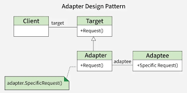
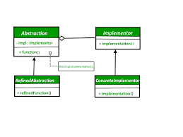
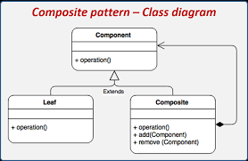
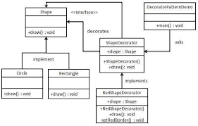
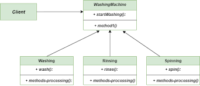

# Familia 2: Patrones Estructurales

Esta familia de patrones se centra en la composición de clases y objetos para formar estructuras más grandes y flexibles, manteniendo una baja dependencia entre componentes.

---

## 1. Adapter (Adaptador)

**Categoría:** Estructural

**Propósito:**  
Permite que clases con interfaces incompatibles trabajen juntas, actuando como un puente entre ellas.

**Estructura UML:**  


**Lenguajes de referencia:**  
### Java
```Java 
// Interfaz esperada
interface EnchufeEuropeo {
    void conectar();
}

// Clase existente incompatible
class EnchufeAmericano {
    void conectarAmericano() { System.out.println("Conectado a 110v"); }
}

// Adaptador
class Adaptador implements EnchufeEuropeo {
    private EnchufeAmericano americano;

    public Adaptador(EnchufeAmericano americano) {
        this.americano = americano;
    }

    @Override
    public void conectar() {
        // Traduce la llamada
        americano.conectarAmericano(); 
    }
}
```
### JavaScript
```JavaScript  
// Sistema antiguo (XML)
class OldSystem {
  getData() { return "<data>Datos</data>"; }
}

// Sistema nuevo (espera JSON)
class NewSystem {
  print(json) { console.log("Imprimiendo JSON:", json); }
}

// Adaptador
class Adapter {
  constructor(oldSystem) { this.oldSystem = oldSystem; }

  getJson() {
    const xml = this.oldSystem.getData();
    // Simulación de conversión
    return { content: xml.replace(/<[^>]*>/g, "") }; 
  }
}
```
---

## 2. Bridge (Puente)

**Categoría:** Estructural

**Propósito:**  
Separa una abstracción de su implementación para que ambas puedan variar independientemente.

**Estructura UML:**  


**Lenguajes de referencia:**  
### Java
```Java 
// Implementación (Color)
interface Color {
    String aplicar();
}
class Rojo implements Color {
    public String aplicar() { return "Rojo"; }
}

// Abstracción (Forma)
abstract class Forma {
    protected Color color;
    public Forma(Color c) { this.color = c; }
    abstract void dibujar();
}

class Circulo extends Forma {
    public Circulo(Color c) { super(c); }
    void dibujar() { 
        System.out.println("Dibujando Círculo " + color.aplicar()); 
    }
}
```
### JavaScript
```JavaScript  
// Implementación: Dispositivo
class TV {
    turnOn() { console.log("TV encendida"); }
    turnOff() { console.log("TV apagada"); }
}

// Abstracción: Control Remoto
class RemoteControl {
    constructor(device) { this.device = device; }
    
    toggle() {
        this.device.turnOn();
    }
}

const tv = new TV();
const remote = new RemoteControl(tv);
remote.toggle();
```
---

## 3. Composite (Compuesto)

**Categoría:** Estructural

**Propósito:**  
Permite tratar objetos individuales y composiciones de objetos de manera uniforme, formando estructuras en forma de árbol.

**Estructura UML:**  


**Lenguajes de referencia:**  
### Java
```Java 
interface Componente {
    void mostrar();
}

// Hoja
class Archivo implements Componente {
    private String nombre;
    public Archivo(String n) { this.nombre = n; }
    public void mostrar() { System.out.println("Archivo: " + nombre); }
}

// Compuesto
class Carpeta implements Componente {
    private List<Componente> hijos = new ArrayList<>();
    
    public void agregar(Componente c) { hijos.add(c); }
    
    public void mostrar() {
        for (Componente c : hijos) c.mostrar();
    }
}
```
### JavaScript
```JavaScript  
class Producto {
    constructor(precio) { this.precio = precio; }
    getPrecio() { return this.precio; }
}

class Caja {
    constructor() { this.contenido = []; }
    agregar(item) { this.contenido.push(item); }
    
    getPrecio() {
        return this.contenido.reduce((sum, item) => sum + item.getPrecio(), 0);
    }
}

const cajaPrincipal = new Caja();
cajaPrincipal.agregar(new Producto(100));
cajaPrincipal.agregar(new Producto(50));
console.log(cajaPrincipal.getPrecio()); // 150
```
---

## 4. Decorator (Decorador)

**Categoría:** Estructural

**Propósito:**  
Añade nuevas responsabilidades a un objeto de manera dinámica sin modificar su estructura original.

**Estructura UML:**  


**Lenguajes de referencia:**  
### Java
```Java 
interface Cafe {
    double costo();
}
class CafeSimple implements Cafe {
    public double costo() { return 10.0; }
}

// Decorador
class ConLeche implements Cafe {
    private Cafe cafe;
    public ConLeche(Cafe c) { this.cafe = c; }
    
    public double costo() {
        return cafe.costo() + 5.0; // Añade costo
    }
}
```
### JavaScript
```JavaScript  
class Notificacion {
    enviar(msg) { console.log(`Enviando correo: ${msg}`); }
}

// Decorador funcional
function notificarConSlack(notificacion) {
    const original = notificacion.enviar;
    notificacion.enviar = function(msg) {
        original(msg); // Llama al original
        console.log(`Enviando a Slack: ${msg}`); // Añade funcionalidad
    }
    return notificacion;
}

const noti = notificarConSlack(new Notificacion());
noti.enviar("Hola!");
```
---

## 5. Facade (Fachada)

**Categoría:** Estructural

**Propósito:**  
Proporciona una interfaz simplificada para un conjunto de interfaces más complejas dentro de un subsistema.

**Estructura UML:**  


**Lenguajes de referencia:**  
### Java
```Java 
class CPU { void freeze() {} }
class Memory { void load() {} }
class HardDrive { void read() {} }

// Fachada
class ComputerFacade {
    private CPU cpu = new CPU();
    private Memory ram = new Memory();
    private HardDrive hd = new HardDrive();

    public void start() {
        cpu.freeze();
        ram.load();
        hd.read();
        System.out.println("PC Iniciada");
    }
}
```
### JavaScript
```JavaScript  
class CompraAPI {
    verificarPago() { return true; }
    verificarStock() { return true; }
    enviarProducto() { console.log("Enviado"); }
}

// Fachada
class TiendaFacade {
    constructor() { this.api = new CompraAPI(); }
    
    comprarRapido() {
        if (this.api.verificarPago() && this.api.verificarStock()) {
            this.api.enviarProducto();
        }
    }
}
```
---

## 6. Flyweight (Peso Ligero)

**Categoría:** Estructural

**Propósito:**  
Reduce el consumo de memoria compartiendo la mayor cantidad de datos posibles entre objetos similares.

**Estructura UML:**  


**Lenguajes de referencia:**  
### Java
```Java 
// Estado compartido (Intrínseco)
class TipoArbol {
    private String nombre; // Ej: "Pino"
    public TipoArbol(String n) { this.nombre = n; }
    public void dibujar(int x, int y) { 
        System.out.println("Arbol " + nombre + " en " + x + "," + y); 
    }
}

// Fábrica
class ArbolFactory {
    static Map<String, TipoArbol> tipos = new HashMap<>();
    
    static TipoArbol getTipo(String nombre) {
        if (!tipos.containsKey(nombre)) {
            tipos.put(nombre, new TipoArbol(nombre));
        }
        return tipos.get(nombre);
    }
}
```
### JavaScript
```JavaScript  
class Libro {
    constructor(titulo, autor, isbn) {
        this.titulo = titulo;
        this.autor = autor;
        this.isbn = isbn;
    }
}

// Flyweight Factory
const biblioteca = new Map();

const crearLibro = (titulo, autor, isbn) => {
    const key = isbn;
    if (!biblioteca.has(key)) {
        biblioteca.set(key, new Libro(titulo, autor, isbn));
    }
    return biblioteca.get(key); // Retorna instancia existente
};
```
---

## 7. Proxy (Representante)

**Categoría:** Estructural

**Propósito:**  
Proporciona un objeto sustituto o intermediario que controla el acceso a otro objeto.

**Estructura UML:**  


**Lenguajes de referencia:**  
### Java
```Java 
interface Internet { 
    void conectar(String web); 
}

class InternetReal implements Internet {
    public void conectar(String web) { System.out.println("Conectando a " + web); }
}

class ProxyInternet implements Internet {
    private InternetReal real = new InternetReal();
    private static List<String> prohibidas = List.of("virus.com");

    public void conectar(String web) {
        if (prohibidas.contains(web)) {
            System.out.println("Acceso denegado");
        } else {
            real.conectar(web);
        }
    }
}
```
### JavaScript
```JavaScript  
const usuarioReal = {
    verExpediente: () => "Datos confidenciales..."
};

// Proxy para seguridad
const proxyUsuario = new Proxy(usuarioReal, {
    get: function(target, prop) {
        if (prop === 'verExpediente') {
            // Validación simulada
            if (!sessionStorage.getItem('isAdmin')) {
                return "Acceso denegado: Requiere Admin";
            }
        }
        return target[prop];
    }
});
```